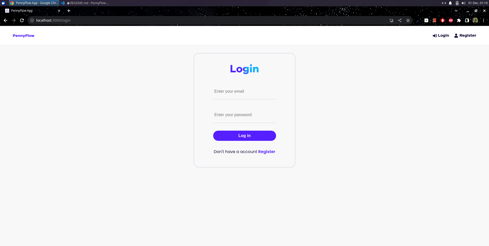
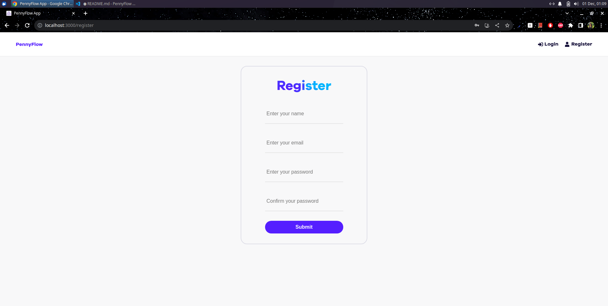

# PennyFlow Web App

## Overview
PennyFlow is a personal finance management web application that allows users to track their expenses and incomes conveniently. It helps users manage their finances more efficiently by providing tools to monitor spending patterns and income sources.

## Features
- **User Authentication**: Secure login and registration system.
- **Expense Management**: Track expenses by category, amount, and date.
- **Income Recording**: Record sources and amounts of income.
- **Dashboard View**: Visual representation of expenses by category and income sources.
- **Budgeting Tool (Under Development)**: Create and manage budgets based on available balances.

## Screenshots
### Dashboard Page

- Description: Overview of expenses by category, providing insights into spending patterns.

### Login/Registration Page

- Description: Secure login and registration page for authenticated access to the PennyFlow application.

## Installation
- Clone the repository: `git clone https://github.com/imansai/PennyFlow.git`
- Navigate to the project directory: `cd PennyFlow`
- Install dependencies: `npm install`
- Run the application: `npm start`

## Technologies Used
- Frontend: HTML, CSS, JavaScript (React)
- Backend: Node.js, Express.js, MongoDB

## Contributors
- [Imane Saibari](https://github.com/imansai)

## License
This project is licensed under the [MIT License](./LICENSE).
